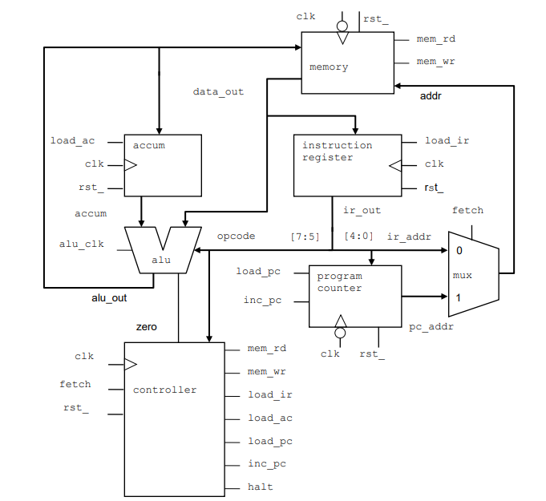

## Project Title: Verifying the VeriRISC CPU

## Project Description:
This project was developed based on the labs from a SV Cadence certification. This is the integration lab for different modules to build a veriRISC CPU based on the design from below image:

## Module Specifications:

### VeriRISC CPU Module
#### Building modules:
- register.sv
- alu.sv
- control.sv
- mem.sv
- scale_mux.sv
- counter.sv
- typedefs.sv

#### Inputs:
- clk
- cntrl_clk
- alu_clk
- fetch
- rst_

#### Outputs:
- halt
- load_ir

## Testbench Module:
- cpu_test.sv
